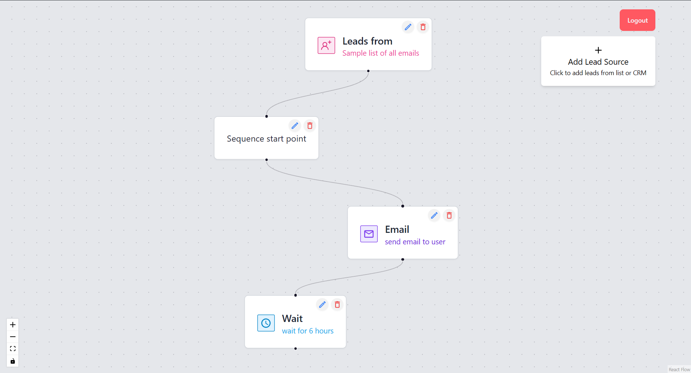

# Reactflow webapp

### For live demo [click here](https://thereactflow.vercel.app/register)

## Description

A web application built with MERN stack allows users to design and implement email marketing sequence using a visual flowchart interface

## Features

- CRUD operations for managing data using MongoDB
- User authentication and authorization
- Integration with the React Flow library for visualizing data flow
- Drag and drop synced with database

## Installation

1. Clone the repository: `git clone https://github.com/itsajaygaur/react-flow.git`
2. Navigate to the project directory: `cd your-repo`
3. Install server dependencies: `cd server && npm install`
4. Install client dependencies: `cd client && npm install`
5. Configure environment variables:
   - Create a `.env` file in the root directory based on `.env.example`
   - Set up MongoDB URI, JWT secret key, and other required variables
6. Start the development server:
   - Run the server and client concurrently: `npm run dev`

## Usage

1. Start the development server using the instructions above.
2. Open your browser and navigate to `http://localhost:3000` (or the specified port).
3. Use the web application to perform CRUD operations, visualize data flow, and authenticate users.

